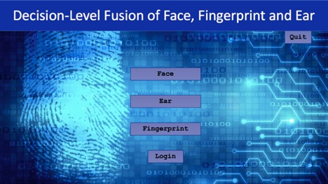
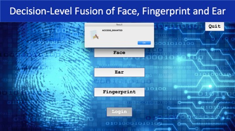
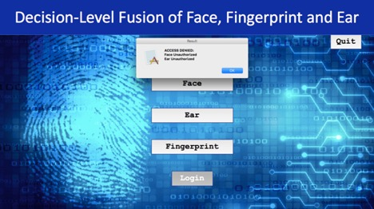

# Decision-Level-Fusion-of-Face-Fingerprint-and-Ear

The traditional methods of authentication such as the usernames and passwords have many limitations. Biometrics based authentication can help overcome some of the limitations. With biometrics users do not have to design and remember strong passwords and biometric traits are not easy to guess.

Most of the current biometric authentication systems use unimodal; they use a single biometric trait to identify the user. The method of authenticating using only one biometric trait also has many limitations. For example, fingerprints can be damaged due to some finger injuries. The iris scan biometric authentication can be compromised by the use of fake contact lenses etc.

Multimodal biometrics, a method of identifying people based on multiple biometrics traits, can help overcome some of the limitations of the unimodal approaches. The multimodal biometric authentication approach can achieve higher performance as poor-quality traits of one biometric modality can be compensated by the high-quality traits in other modalities.

The objective of this project is to develop a multimodal biometric authentication application considering more than one biometric trait. User authentication will be performed with the use of three of the user’s biological traits: Face, Fingerprint, and Ear.

Convolutional Neural Networks are used to train each of the user's biometric trait and make the prediction. It is a "User Verification" problem, where the system will predict whether the user is authorized to access or not. It is a binary classification problem for each convolutional neural network. All the CNNs are trained considering me as the "Authorized user" and rest all are "Unauthorized".

Run the "exp.py" python file and an application GUI as shown in the image below will appear.

Figure 1: The screenshot of the application GUI.

When the user clicks on any of the biometric traits button, the system will access the webcam to get the images. The user needs to provide all three required biometric traits images to make prediction and gain access. 

Figure 2: The screenshot of the application predicting the authorization status of the user and giving a pop-up window with the message, “Access Granted”.

Figure 3: The screenshot of the application predicting the authorization status of the user and giving a pop-up window with the message, “Access Denied”.
